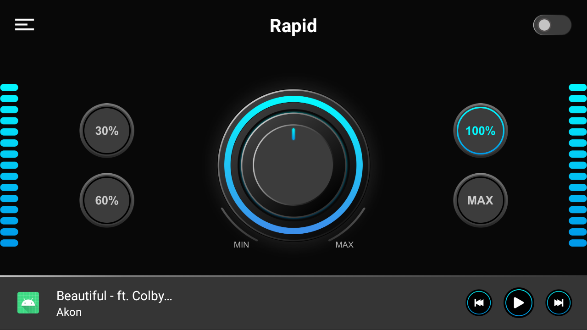

# Rapid Resize
 Hello World!
 
 A library that automatically resize your XML layout with device width and height.
 No matter your device orientation is protrait or landscape.
 
## Important
- Create your design with default 1080x1920 screen size.
- For better experience hide navigation and status/notification bar.

## SDK Information
minSDKVersion: 16 & maxSDKVersion: 30
[](https://jitpack.io/#fiftyonemoon/Rapid)

 ## Implementation

```groovy
allprojects {
	repositories {
		maven { url 'https://jitpack.io' }
	}
}
```

```groovy
implementation 'com.github.fiftyonemoon:Rapid:1.0.3.1'
```
## Overview

This library have 5 modified views which is based on Android original views:

- [`RapidConstraintLayout`](rapid/src/main/java/com/fom/rapid/views/RapidConstraintLayout.java)
- [`RapidRelativeLayout`](rapid/src/main/java/com/fom/rapid/views/RapidRelativeLayout.java)
- [`RapidLinearLayout`](rapid/src/main/java/com/fom/rapid/views/RapidLinearLayout.java)
- [`RapidFrameLayout`](rapid/src/main/java/com/fom/rapid/views/RapidFrameLayout.java)
- [`RapidImageView`](rapid/src/main/java/com/fom/rapid/views/RapidImageView.java)

## Attrs Usage

- [`attrs`](rapid/src/main/res/values/attrs.xml) Check out the attrs and their usage.

## XML Usage
This is sample of layout.

- [`rapid_constraint_layout`](app/src/main/res/layout/rapid_constraint_layout.xml)

(1) [`RapidConstraintLayout`]

```
<?xml version="1.0" encoding="utf-8"?>
<com.fom.rapid.views.RapidConstraintLayout xmlns:android="http://schemas.android.com/apk/res/android"
    xmlns:app="http://schemas.android.com/apk/res-auto"
    xmlns:tools="http://schemas.android.com/tools"
    android:layout_width="match_parent"
    android:layout_height="match_parent"
    android:orientation="horizontal"
    android:gravity="center"
    android:background="@drawable/bg"
    app:measureWith="width"  		//Measure view with width
    app:measureMargin="false" 		//Keep applied margin as it is
    app:measurePadding="true" 		//Resize applied padding
    app:resizeChildren="true"		//Resize this parent (RapidConstraintLayout) children
    tools:context=".MainActivity">

    <!--Add your views here-->

</com.fom.rapid.views.RapidConstraintLayout>
```
## Device Sample

(1) 720x1280 	(2) 1080x1920

 

(3) Landscape 720x1280


